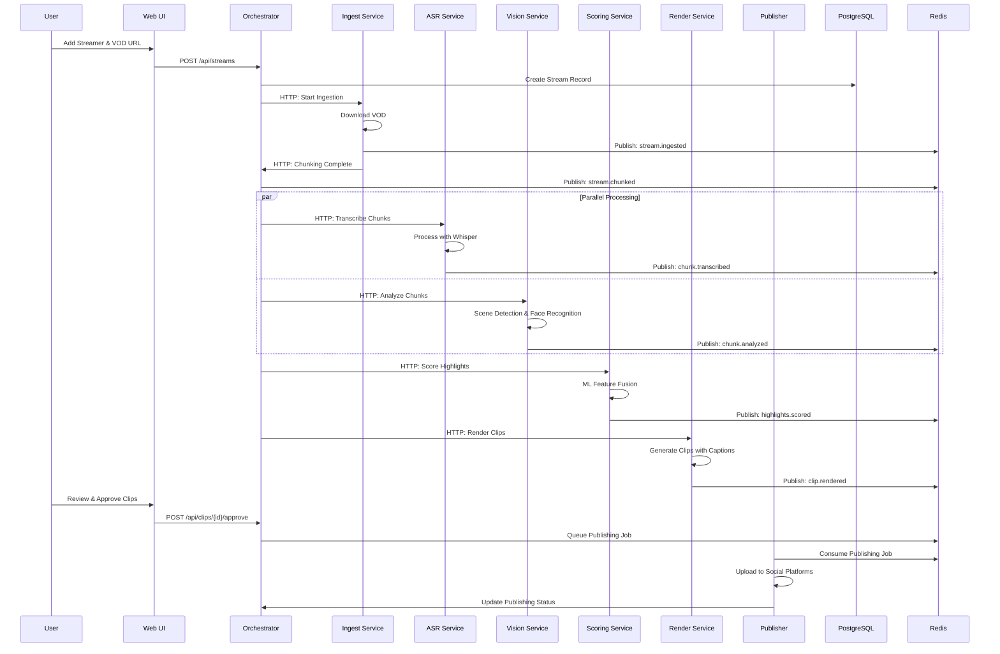
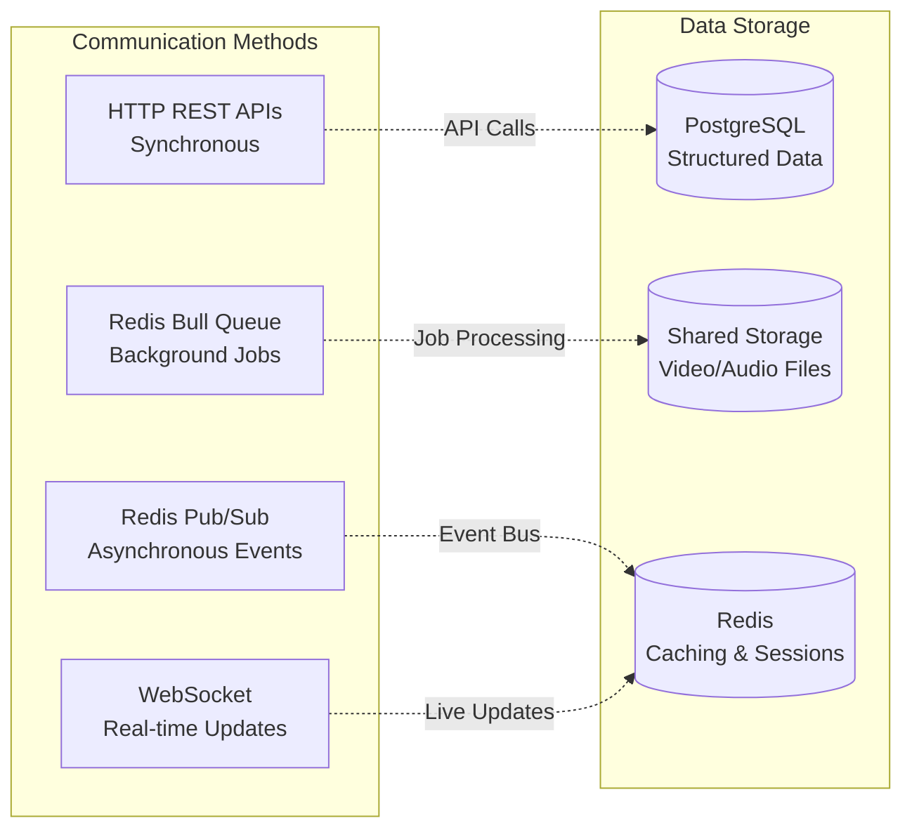

# ClipForge Architecture Diagram

## System Overview

```mermaid
graph TB
    %% External Systems
    subgraph "External Platforms"
        TWITCH[Twitch VODs]
        YOUTUBE[YouTube VODs]
        SOCIAL[Social Media Platforms<br/>YouTube Shorts, X/Twitter]
    end

    %% Frontend Layer
    subgraph "Frontend Layer"
        WEB[Web UI<br/>Next.js<br/>Port: 3000]
    end

    %% Core Applications
    subgraph "Core Applications"
        ORCH[Orchestrator<br/>NestJS API<br/>Port: 3001]
        PUB[Publisher<br/>Node.js<br/>Social Media Publishing]
    end

    %% Processing Services
    subgraph "Processing Services"
        INGEST[Ingest Service<br/>Python/FastAPI<br/>Port: 8001<br/>VOD Download & Chunking]
        ASR[ASR Service<br/>Python/FastAPI<br/>Port: 8002<br/>Speech Recognition]
        VISION[Vision Service<br/>Python/FastAPI<br/>Port: 8003<br/>Scene Detection & Face Recognition]
        SCORING[Scoring Service<br/>Python/FastAPI<br/>Port: 8004<br/>ML Highlight Scoring]
        RENDER[Render Service<br/>Python/FastAPI<br/>Port: 8005<br/>Video Rendering & Captions]
    end

    %% Infrastructure
    subgraph "Infrastructure"
        POSTGRES[(PostgreSQL<br/>Database)]
        REDIS[(Redis<br/>Queue & Events)]
        STORAGE[(Shared Storage<br/>Video Files)]
    end

    %% Data Flow - User Interactions
    WEB -->|HTTP API| ORCH
    ORCH -->|WebSocket| WEB

    %% Data Flow - Stream Processing
    ORCH -->|HTTP Request| INGEST
    INGEST -->|Download VOD| TWITCH
    INGEST -->|Download VOD| YOUTUBE
    INGEST -->|Store Files| STORAGE
    INGEST -->|Publish Event| REDIS

    %% Data Flow - Chunk Processing Pipeline
    ORCH -->|HTTP Request| ASR
    ORCH -->|HTTP Request| VISION
    ASR -->|Store Transcription| STORAGE
    VISION -->|Store Analysis| STORAGE
    ASR -->|Publish Event| REDIS
    VISION -->|Publish Event| REDIS

    %% Data Flow - Scoring and Clipping
    ORCH -->|HTTP Request| SCORING
    SCORING -->|Read Analysis Data| STORAGE
    SCORING -->|Publish Event| REDIS

    %% Data Flow - Rendering
    ORCH -->|HTTP Request| RENDER
    RENDER -->|Read Source Files| STORAGE
    RENDER -->|Store Rendered Clips| STORAGE
    RENDER -->|Publish Event| REDIS

    %% Data Flow - Publishing
    ORCH -->|Queue Job| REDIS
    PUB -->|Consume Jobs| REDIS
    PUB -->|Upload Clips| SOCIAL
    PUB -->|Update Status| ORCH

    %% Database Connections
    ORCH -->|CRUD Operations| POSTGRES
    ORCH -->|Queue Management| REDIS

    %% Event Bus
    REDIS -.->|Event Notifications| ORCH
    REDIS -.->|Event Notifications| WEB

    %% Styling
    classDef frontend fill:#e1f5fe
    classDef core fill:#f3e5f5
    classDef processing fill:#e8f5e8
    classDef infrastructure fill:#fff3e0
    classDef external fill:#fce4ec

    class WEB frontend
    class ORCH,PUB core
    class INGEST,ASR,VISION,SCORING,RENDER processing
    class POSTGRES,REDIS,STORAGE infrastructure
    class TWITCH,YOUTUBE,SOCIAL external
```

## Data Flow Sequence

## Service Communication Patterns

## Key Components Details

### Core Applications
- **Orchestrator (NestJS)**: Central API gateway, job orchestration, database management
- **Web UI (Next.js)**: React-based interface for clip review and management
- **Publisher (Node.js)**: Handles social media publishing to YouTube Shorts, X/Twitter

### Processing Services
- **Ingest Service**: Downloads VODs using yt-dlp, segments into chunks
- **ASR Service**: Speech-to-text using Faster Whisper
- **Vision Service**: Scene detection with PySceneDetect, face recognition with InsightFace
- **Scoring Service**: ML-based highlight detection and ranking
- **Render Service**: Video rendering with FFmpeg, caption burning

### Infrastructure
- **PostgreSQL**: Primary database for structured data (streamers, streams, clips, jobs)
- **Redis**: Event bus, job queues, caching, real-time communication
- **Shared Storage**: Video files, rendered clips, temporary processing files

### Data Entities
- **Streamer**: Content creator information and settings
- **Stream**: VOD metadata and processing status
- **Chunk**: Segmented video pieces with transcription and analysis
- **Clip**: Generated highlights ready for review and publishing
- **Job**: Processing task tracking and status

### Event Types
- `stream.ingested`: VOD download completed
- `stream.chunked`: Video segmented into chunks
- `chunk.transcribed`: Speech recognition completed
- `chunk.analyzed`: Visual analysis completed
- `highlights.scored`: ML scoring completed
- `clip.rendered`: Video rendering completed
- `clip.approved`: User approved for publishing
- `clip.published`: Successfully published to social media
